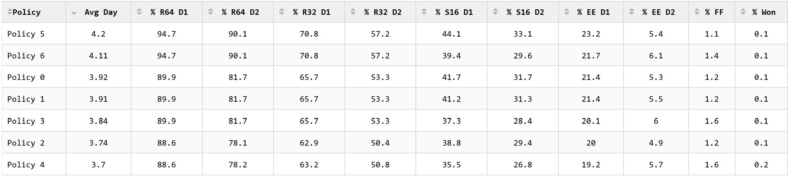
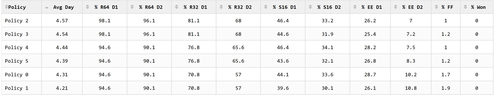
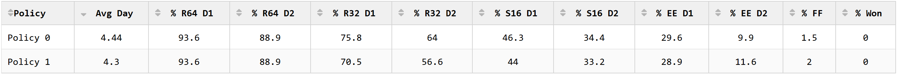

# cbb_survivor_sim

This is a simulation of march madness tournaments designed to help with choosing policies in a survivor pool. 

Most people know of survivor pools in the NFL: you pick one team each week. If they win, you are still in. If they lose, you are out. The other caveat: once you pick a team, you can't pick them again.

The March Madness survivor pool is very similar. You pick a team every day of March Madness (except Sweet Sixteen where you pick any 2 over 2 days). Survive and advance, but you can't pick the same team twice.
The big question here is: do we want to prioritize picking teams that are going to win now for sure, or save them for later? If we pick too many good teams now, we run the risk of not having any left in the later rounds.
If we pick worse teams now, we might lose too early.

This is a classic problem for a Monte Carlo simulation: what if we were able to create different policies/strategies for picking our teams.
With win probability data for every possible combination of games, we could run a simulation hundreds of thousands of times and see which policies come out on top.
There are essentially two parts to this simulation. The first part simulates March Madness. The second picks survivor teams for whatever policies we want to test along the way.

README Sections:
- Analysis (cool findings, non-technical)
- Limitations and Future Directions (not too technical, good to consider when interpreting results)
- Running the Solution (you're an interested nerd and want to run it yourself)
- In-depth Methodology (wow, you're really a nerd. here are the computational weeds)

Reach out to Steve at sczarnecki1212@gmail.com with questions

<br>
<br>

## SECTION 1: Analysis

I'll start with the findings because they are more interpretable. 

These are the parameters I could change for each strategy:

- `next_round_weights`: for each round in the sim, how should I weight the teams' chances to advance to each round? For example, if my weights for the first round were [.8, .2, 0, 0, 0], then
    the function to determine what team I pick in that round would be (P(winning this round) * .8) + (P(Winning next round) * .2) + (P(Winning in two rounds) * 0) + ... .
    You can have different weights for different rounds (e.g. for R64 you have those weights but in R32 you weight it [.9, .1, 0, 0], etc)
- `ignore_seeds`: for R64 and R32, you can exclude the choosing of any seed numbers you want. A parameter of [1] for the first round would prevent a 1 seed from being chosen
- `randomness`: you can choose to have randomness for the selection of teams in the R64 or R32. The teams are all ranked based on the weighted function, but once they are ranked, you can choose a team other than the best.
    For example, if the parameter is [.5, .5], then you have a 50% chance of selecting the best team and a 50% chance of selecting the second best team.
- `min_region`: you can make it so you can't select a team in a region if there are only N amount of teams left in that region in the first three rounds.
    So, if there is only 1 valid team left in the East in the S16 and you set the minimum to one, that team cannot be picked in that round.
- `smart_last_rounds`: the idea here is that to make it to the very end, you have to choose teams in the Elite Eight and Final Four who will eventually lose.
    For example, if you choose the future National Champion to win in the Final Four, you won't be able to pick them for the Natty since you picked them for the Final Four. The best you can do is make it to the Natty.
    If you choose teams in the Elite 8 who will win the Final Four, the same applies. So, this parameter picks the second best options for those rounds.

For the runs, I ran 5000 iterations for seasons [2015, 2016, 2017, 2018, 2024, and 2025]. I determine the years by finding the Wasserstein distances between the years' win probability distributions. Those were the most similar to each other and had extremely similar distributions compared to the others.

One other thing to note before we go into the runs is the objective of the survivor pool. It'd be great to get every round right all the way to the championship, but we often don't need that. Usually, the survivor pool only lasts until the Elite 8. If you can make it past that point or even just hit 1 of 2 Elite Eight teams, you are in good shape. So, I wanted to prioritize EE% as my goal, also using Average Days lasted as another evaluation metric.

For my initial runs, I tried using all of the parameters. I used different combinations of next round weights (usually doing the current round and the last round), ignoring 1 and 2 seeds, keeping a 1-2 team minimum on the regions, and using smart last rounds. I noticed an initial trend: the more straightforward the params, the better. Making them fancy and not picking the teams that had the best chances to win right now hurt us in the long run.

The first example of this I'll show is when I tested removing the 2-seed blocker. It ended up being better to keep the 1-seed blocker, but removing the 2 was better for both Avg Days and EE D2, as you can see in the image below (Policies 5 and 6). To note, I weighted Policy 5's rext round weights more "Win Now" heavy while I weighted Policy 6 more "Win Later" heavy. It's interesting that Win Now did better for EE D1 but Win Later did better for EE D2.



I then pulled the smart last rounds params out, first not using the EE param then not using the FF param. These showed similar results, so I removed the smart last round params.

At this point, I tested more seed block strategies, seeing if it was best to block the 1 seed in the first round only (P4 and P5), first and second rounds (P0 and P1), or neither (P2 and P3). For average days, blocking neither one, which makes sense: upfront you get more wins and this trickles down. But interestingly, the blocking in both rounds jumped EE D1% up and EE D2% up a bunch (to 10%). Ultimately, I decided to meet in the middle of the two eval criteria and go with the block the 1st seed in the 1st round. I would go back and test 1st and 2nd round blocks later.



At this point, I felt that I had a good sense for the parameters other than next round weights: only use the seed blocker. It's probably going to be best to just block Seed 1 in R64 or R64 and R32. So, I played around with the next round weights a little bit. I ran it a bunch of times, so I will spare the analysis on them all. But, I found the best combination below:

```yaml
- next_round_weights:
    r0: [.8, -.2, 0, 0, 0, 0]
    r1: [.9, -.1, 0, 0, 0]
    r2: [.8, -.2, 0, 0]
    r3: [1, 0, 0]
    r4: [1, 0]
```

After finding good weights, I finally tested the just R1 1-Seed block and the R1 and R2 1-Seed block. As expected, the EE D2% shot up to over 11% and the EE D1 was barely sdmaller at 28.9% compared to 28.6%.



Usually, I think the policy with the best EE D2% is going to win. So, I'm choosing this as my optimal strategy after initial analysis:

```yaml
policy_list:
  - next_round_weights:
      r0: [.8, -.2, 0, 0, 0, 0]
      r1: [.9, -.1, 0, 0, 0]
      r2: [.8, -.2, 0, 0]
      r3: [1, 0, 0]
      r4: [1, 0]
    smart_last_rounds:
      ee_swap: false
      ff_swap: false
    randomness:
      r0: false
      r1: false
    min_region:
      r0: 1
      r1: 1
      r2: 1
    ignore_seeds:
      r0: [1]
      r1: [1]
```

More analysis can definitely be done. I just squeezed this in right before the tourney. But, I think it's a good start.

Overall, it is best to be conservative. Take the more win-now approaches. However, it will help your chances slightly if you block the 1-seed from contention in the first two rounds and dowweight this current round slightly, as long as your goal is to make it past the Elite Eight.


<br>
<br>

## SECTION 2: Limitations and Future Directions

There were some limitations when analyzing this data:

- **Win Probability Validity**: win probability data comes from Bart Torvik, a reputable Sports Analytics source. However, I did not do any of my own analysis of his accuracy of win probabilities. There is definitely some bias in these predicted probabilities, so they are not 100% representative of real-world probabilities, as with any model. I chose to do it this way with getting all of the potential win prob combinations so that the simulation could run smoothly. However, it is important to consider that there is likely some error to the win probs.
- **Real-World Factors/Dependence**: each game is treated as an independent event in this simulation. However, real-life is different, with injuries, momentum, and other factors that aren't considered. I still believe that most aspects of the games are independent, so this is fine for our purposes.
- **Chosen Seasons**: to find similar seasons to our most recent (2025), we computed Wasserstein Distances for every year of data we have, comparing the similarities between win probability distributions. In the end, we determined that 2015-2018 and 2024-2025 were the years most similar to each other. Although these years are similar to recent trends, who knows how long they will be true for. Additionally, 6 different brackets isn't a ton for the simulation. Just something to consider during interpretation.
- **Real-Life Applicability/High Variance**: in terms of implementation, this simulation aims to give you an edge by finding optimal policies. However, in terms of real-world applicability, there is so much variance in just one March Madness bracket that you're not going to see consistent results from using these policies from year to year. It might be a little better if you have multiple entries and diversify, but there is still way too much variance.

Future directions:

- **Diversification/Multiple Entries**: I didn't have time now, but I would love to experiment with multiple policies acting together as a diversified portfolio. So, assume we enter a few polcies at a time into the same pool. Then, we avoid picking the same teams among our portfolio and try to maximize our chances of winning. I do this with my friends in my real-life pool, so it would be cool to try strategies. It is definitely possible to add but would take a lot more time. Maybe next year
- **In-Tournament Run Option**: right now, this repo just runs the simulation for the entire tournament. It would be cool to build out a script that starts from a certain point in the tournament. This would make things easier when people are in the middle of the tournament and are trying to use this to make decisions. I would ideally be able to modify the outcomes of the tournament so that the teams who have won in real life are set as the teams in the sim.

<br>


## SECTION 3: Running the Solution

I had GitHub Copilot write this section in case I need to go back and remember how to run it. Don't need to read this all.

The `analysis/` folder contains a **Dash app** (`analysis/app.py`) that reads previously-saved simulation outputs from `sim_saves/` and provides interactive summaries/visualizations.

It’s designed around this loop:

1) **Set sim parameters (which seasons, how many iterations, what policies)**  
2) **Run the sim (VS Code task) to generate `sim_saves/run_<sim_id>/...` outputs**  
3) **Start the Dash app and explore the run(s)**

---

### 1) Configure what you want to analyze (`config/sim_params.yml`)

The simulator reads parameters from `config/sim_params.yml` (as referenced by `src/__main__.py`). A minimal example is like the one you provided:

```yaml
seasons:
  - 2015
  - 2016
  - 2017
  - 2018
  - 2024
  - 2025

n_iter: 5000

policy_list:
  - next_round_weights:
      r0: [1, 0, 0, 0, 0, 0]
      r1: [1, 0, 0, 0, 0]
      r2: [.8, 0, 0, -.2]
      r3: [1, 0, 0]
      r4: [1, 0]
    smart_last_rounds:
      ee_swap: false
      ff_swap: false
    randomness:
      r0: false
      r1: false
    min_region:
      r0: 2
      r1: 2
      r2: 1
    ignore_seeds:
      r0: [1]
      r1: false

  - next_round_weights:
      r0: [1, 0, 0, 0, 0, 0]
      r1: [1, 0, 0, 0, 0]
      r2: [1, 0, 0, 0]
      r3: [1, 0, 0]
      r4: [1, 0]
    smart_last_rounds:
      ee_swap: false
      ff_swap: false
    randomness:
      r0: false
      r1: false
    min_region:
      r0: 2
      r1: 2
      r2: 1
    ignore_seeds:
      r0: [1]
      r1: false
```

**What this controls for analysis:**
- `seasons`: which season files the Dash app will be able to load (and it will also offer an `"All"` option if multiple seasons exist for a run).
- `n_iter`: affects stability of charts/tables (and controls compute time).
- `policy_list`: each YAML item becomes “Policy 0”, “Policy 1”, etc. in the dashboard.

> Note: In the current repo snapshot I pulled, `config/` was not present at the repo root (GitHub returned “not found”), but `src/__main__.py` does expect `config/sim_params.yml`. So for a clean README, you likely want to ensure `config/sim_params.yml` exists in the repo (or explain that users must create it).

---

### 2) Run the simulation (VS Code task)

This repo includes a VS Code build task:

- `.vscode/tasks.json` defines a task labeled **“Run Sim”** that runs:
  - `python -m src`
  - with `PYTHONPATH` set to `${workspaceFolder}/src`

**How to run it in VS Code:**
1. Open the repo folder in VS Code.
2. Run **Tasks: Run Task**
3. Select **Run Sim**

This generates a new timestamped run folder:

```
sim_saves/
  run_<sim_id>/
    survivor_results/
    tourney_results/
    chosen_teams/
    run_<sim_id>_config.yaml
    sim_params.yml
```

Those CSVs are exactly what the Dash app loads.

---

### 3) Start the Dash app (`analysis/app.py`)

The Dash app is in `analysis/app.py`. It looks for outputs relative to the repo root:

- `SIM_SAVES_DIR = <repo_root>/sim_saves`
- Team name mapping file:
  - `analysis/teams_id_map.csv`

**Run it from the repo root:**
```bash
python analysis/app.py
```

It starts the Dash server in debug mode (`app.run(debug=True)`).

#### What the app expects to find
For each run directory under `sim_saves/` (e.g. `run_20260309_12.34.56_...`), it expects CSVs in:

- `sim_saves/<run_id>/survivor_results/*.csv`
- `sim_saves/<run_id>/tourney_results/*.csv`
- `sim_saves/<run_id>/chosen_teams/*.csv`

The UI populates the **Run** dropdown by listing directories in `sim_saves/`, newest first.

#### Season selection
When you pick a run, the app inspects `survivor_results/*.csv` filenames and extracts the season from the tail of the stem (it splits on `_` and uses the last token). If it finds multiple seasons for that run, the Season dropdown includes:

- `All` (concatenates all seasons’ CSVs side-by-side)
- each specific season

#### Team names vs “Team 12”
If `analysis/teams_id_map.csv` exists and contains a column for that season year, the app will label teams by name. Otherwise it falls back to generic `Team <id>` labels.

---

### 4) What you can analyze in the dashboard

Tabs currently implemented:

- **Policy Summary Table**
  - “Avg Day” survived and percent reaching each stage (R64 D1/D2, R32, S16, Elite 8 variants, FF, Won)
- **Policy Bar Chart**
  - Same idea, but one metric at a time with 95% CI error bars
- **Survival Curves**
  - For each policy: % still alive after each tournament “day”
- **Team Advancement**
  - For each team: average round reached and % reaching each round (based on `tourney_results`)
- **Team Bar Chart**
  - Choose “Avg Round” or % reaching milestones, with 95% CI
- **Team Pick Frequency**
  - Heatmap of how often each policy picked each team (parsed out of the `chosen_teams` CSVs)

<br>
<br>

## SECTION 4: In-Depth Methodology (simulation + parameters)

I had GitHub Copilot write this section. It's helpful if I have to go back in the future to remember what I did. You don't need to read this all.

This repository simulates **NCAA Men’s Tournament (“March Madness”) outcomes** and evaluates **survivor-pool picking strategies (“policies”)** via Monte Carlo. The core logic lives in `src/`:

- `src/__main__.py` orchestrates a run (loads parameters, loops seasons, runs simulations, writes outputs).
- `src/utils/sim_data_prep.py` converts raw CSV inputs into the arrays the simulator needs.
- `src/utils/run_sim_funcs.py` contains the simulator (`TournamentSimulator`) and the survivor-pool strategy engine.

Below is a walk-through of the flow and the key parameters that control it.

---

### 1) Entry point orchestration (`src/__main__.py`)

Running the package (e.g. `python -m src`, depending on your environment) executes `src/__main__.py`, which:

1. Defines two “global-ish” tournament structure pieces:
   - `days_by_round = [2, 2, 2, 1, 1, 1]`  
     Interpreted as: R64 has 2 days, R32 has 2 days, Sweet 16 has 2 days, then Elite 8 / Final 4 / Title are single-day rounds (with a special handling of Elite 8 described later).
   - `still_alive_arr_orig = np.ones((68,), dtype=int)`  
     The tournament is modeled as **68 teams** (including First Four). A `1` means “team is alive”, `0` eliminated.

2. Loads run parameters from:
   - `config/sim_params.yml`

3. Calls `run_full_sim(...)`, which:
   - Creates a unique `sim_id` timestamped in `America/New_York` timezone.
   - Loops over each season in `sim_params["seasons"]`:
     - Builds season-specific simulation inputs via `prep_data(season)` (from `sim_data_prep.py`).
     - Creates a `SimConfig` object and passes it to `TournamentSimulator`.
     - Calls `sim.run_sim()`.

4. Writes a copy of the run parameters into:
   - `sim_saves/run_<sim_id>/sim_params.yml`

So conceptually, `__main__.py` is the driver: **load config → prep data → run Monte Carlo → save outputs**.

---

### 2) Data preparation (`src/utils/sim_data_prep.py`)

`prep_data(season)` turns “human-readable” / tabular inputs into efficient numeric structures for simulation. It returns an `initial_data_dict` consumed by `SimConfig`.

#### 2.1 Input files (from `input_data/`)
`_load_data(season)` reads three CSVs and filters them to the chosen season:

- `final_bracket_df_w_seed.csv`  
  Bracket structure: team names, rounds, seeds, and “next_game_id” columns that indicate future game slots.
- `final_pairs_final.csv`  
  Matchup win probabilities. The code pivots this into a team-vs-team win probability matrix.
- `date_final_all.csv`  
  A mapping from `game_id → day_num` (used to split early rounds into Day 1 / Day 2 slates).

#### 2.2 Team indexing model (important)
A central modeling choice: teams are assigned an internal **team id** based on **alphabetical ordering of `team1_name`** after first-round bracket expansion logic. Nearly every array is indexed by this team id.

This is why you’ll see repeated `.sort_values("team1_name")` calls before converting to numpy arrays: it enforces a stable mapping from names to indices.

#### 2.3 First Four handling
The bracket input includes “First Four” rows and “Winner …” placeholder strings that later map into Round-of-64 games. The prep step does two things:

- `_structure_bracket(...)`:
  - Extracts First Four teams.
  - Replaces “Winner” placeholders in Round-of-64 rows with the actual possible First Four teams, effectively duplicating/expanding those entries as needed.
  - Produces:
    - `bracket_df_struct`: a “Round of 64 and beyond” bracket table (still with `next_game_id0..5` columns)
    - `team_seed_arr_orig`: seed per team id

- `_create_first4_pairs(...)`:
  - Builds `first4_pair_list`: a list of 4 matchups, each matchup expressed as a pair of **team ids**.
  - These are simulated before the main bracket.

#### 2.4 Bracket-to-array conversion (round structure)
`_create_bracket_arr(bracket_df_struct)` builds:

- `bracket_arr_orig`: shape roughly `(68, 6)`  
  `bracket_arr_orig[team_id, round_id] = game_id_index`  
  where `round_id` 0..5 corresponds to the sequence of rounds in the main tournament (R64 → Title).
- `unique_games_all`: a list of lists, per round, containing the unique game ids.

A key step here is **re-mapping game ids** into contiguous integers (`id_map`) so the simulation can treat them as numeric indices.

#### 2.5 Day structure (Day 1 vs Day 2)
`_create_dates_and_days(...)` produces:

- `dates_arr`: array indexed by game id index giving the day number.
- `team_day_list`: list structure that encodes, for early rounds, whether a team can appear on Day 1 or Day 2:
  - `team_day_list[r][d][team_id] ∈ {0,1}` for rounds `r = 0..2` and days `d = 0..1`

This is used by survivor strategies so they only pick among teams actually playing on that day.

#### 2.6 Potential opponent matrices
`_create_potential_opps_arr(bracket_arr_orig)` builds `potential_opps_arr_orig`, a list of 6 square matrices:

- For each round `r`, `potential_opps_arr_orig[r][i, j] = 1` if team `i` can play team `j` in that round.
- Constructed by equality of bracket game ids per round, and then differenced so “future-round possible opponents” don’t include teams you were already scheduled to potentially face earlier.

This matrix is central to computing “who a team could face” in each round.

#### 2.7 Team–game membership matrix
`_create_game_match_arr(bracket_df_struct)` constructs:

- `game_match_arr_orig`: binary matrix where `game_match_arr_orig[team_id, game_id] = 1` if that team could appear in that game slot (across all rounds).

During simulation, once a team is eliminated, that team’s row is zeroed, which allows retrieving “the two teams in game g” via `np.flatnonzero(game_match_arr[:, g] == 1)`.

#### 2.8 Unique games per day
`_create_unique_games_comb(dates_arr, unique_games_all)` returns:

- `unique_games_comb = [unique_games_d1, unique_games_d2]`

Each `unique_games_d*` is a list of length 6 (rounds). For rounds 0–2, games are split into Day 1 and Day 2. For rounds 3–5, the code assigns all games to “Day 1” (and the simulator treats the round as 1-day anyway).

This is what the simulator loops over to simulate the correct subset of games on each day.

#### 2.9 Win probability matrix
`_create_wp_arr(win_prob_df)` builds:

- `wp_arr_orig`: a dense float array where `wp_arr_orig[i, j]` is the probability team `i` beats team `j`.

This is the core stochastic driver of game results.

#### 2.10 Region groupings (Elite Eight / Final Four)
`_create_ff_ee_groups(bracket_arr_orig)` produces dicts like:

- `groups_ee_orig["group1".."group4"]`: team ids grouped by Elite Eight “bucket”
- `groups_ff_orig["group1".."group2"]`: team ids grouped by Final Four “bucket”

These are used by certain survivor policy constraints and “smart last rounds” heuristics.

---

### 3) Simulation engine (`src/utils/run_sim_funcs.py`)

There are two major layers:

1. **Tournament outcome simulation** (random bracket outcomes)
2. **Survivor policy simulation** (strategies picking teams subject to constraints)

#### 3.1 Configuration object (`SimConfig`)
`SimConfig` is a container that binds together:

- Run identifiers:
  - `sim_id`: used for save folder naming
  - `season`
  - `n_iter`: number of Monte Carlo iterations

- Survivor policy definitions:
  - `survivor_policies`: loaded from YAML as `sim_params["policy_list"]` (despite the name “list”, it’s used as an indexable collection of policies)

- Precomputed data structures (from `prep_data`):
  - `first4_pair_list`
  - `wp_arr_orig`
  - `bracket_arr_orig`
  - `game_match_arr_orig`
  - `potential_opps_arr_orig`
  - `team_seed_arr_orig`
  - `team_day_list`
  - `unique_games_comb`
  - `groups_ff_orig`, `groups_ee_orig`

- Run-time constants:
  - `still_alive_arr_orig` (starts as ones)
  - `days_by_round`

It also currently hard-sets:
- `store_tourney_results = True`
- `run_survivor = True`
- `store_picked_teams = True`

So, by default, a run simulates *both* the tournament *and* the survivor strategies, and writes all outputs.

#### 3.2 Per-iteration tournament simulation (`TournamentSimulator.run_sim`)
At a high level:

For each iteration `i in range(n_iter)`:

1. Reset iteration state:
   - `wp_arr` is copied from `wp_arr_orig`
   - `game_match_arr` copied from original
   - `still_alive_arr` reset to all ones

2. Initialize survivor tracking (if enabled):
   - `policies_alive`: vector of 1/0 per policy
   - `not_picked`: per-policy availability mask over teams (starts all ones)
   - `policies_round_out`: stores “day index” when eliminated

3. **Simulate First Four**:
   For each `(t1, t2)` in `first4_pair_list`:
   - Sample winner using `t1_wp = wp_arr[t1][t2]`
   - Loser gets:
     - `still_alive_arr[loser] = 0`
     - `wp_arr[loser, :] = 0` and `wp_arr[:, loser] = 0` (removes them from future matchups)
     - `game_match_arr[loser, :] = 0` (removes them from all game slots)
   - Record loser’s exit round in `tourney_results`

4. **Simulate main tournament rounds**:
   The loop structure is:
   - for round `r = 0..5`
   - for day `d = 0..days_by_round[r]-1`
   - for each game `g in unique_games_comb[d][r]`:
     - find teams `t1, t2` currently in that game using `game_match_arr`
     - sample winner using `wp_arr[t1][t2]`
     - eliminate loser (same “zeroing” approach as above)
     - record results

5. **Survivor policy picks and elimination logic**
   On each simulated “day”, before simulating games, the code calls:

   - `chosen_teams = survivor_choose_team(...)`

   Then after games complete for that day, it checks whether each policy’s chosen team(s) are still alive and updates `policies_alive` and `policies_round_out`.

   Special case: **Elite Eight (`r == 3`)**
   - Policies pick **two teams** (one from each Final Four side), and they must both survive.
   - The code stores two pick columns for that “day block” and has logic to adjust the “day out” index depending on whether one or both picks lose.

#### 3.3 How survivor policies choose teams (`survivor_choose_team`)
This function is the “strategy engine”. It tries to choose, for each policy, the best available team for the current round/day according to a forward-looking objective.

**Step A: Compute per-team probabilities of advancing/winning future rounds**

For each round `r` from current `r_cur` through the title game:

- It filters `wp_arr` down to only **possible opponents in that round** using:
  - `next_wp_arr = potential_opps_arr[r] * interm_wp_arr`

- For rounds beyond the current one, it *weights opponent contributions* by their probability of reaching that future round, using a cumulative product of prior-round win probabilities.

The result is:
- `all_rd_wps_arr[team_id, k]` = estimated probability of winning round `r_cur + k` (under the model’s assumptions and the current “still alive” state).

**Step B: Turn future-round probabilities into an objective score**
For a given policy and current round `r_cur`:

- If `r_cur < 5`, it pulls a vector of weights for “importance” of each remaining round and computes something like:

  `obj_arr[team] = Σ_k ( all_rd_wps_arr[team, k] * weight[k] )`

- If `r_cur == 5` (championship), it just sums.

**Step C: Apply feasibility masks / constraints**
The objective gets zeroed out for teams that are not allowed:

- Must not have been picked already by that policy:
  - `obj_arr *= not_picked[p_iter]`
- For early rounds (0–2): must be playing on the current day:
  - `obj_arr *= team_day_list[r_cur][d]`
- Optional seed restrictions for rounds 0–1:
  - If `policy["ignore_seeds"]["r0"]` / `["r1"]` is set, those seeds are removed.

There are also policy-level heuristics:

- `min_region` (rounds < Elite Eight):
  - Prevents over-consuming a region by filtering choices based on how many “available” teams remain within each Elite Eight group.
- `smart_last_rounds` (Elite Eight / Final Four):
  - Elite Eight: if enabled, can intentionally take “second-best” options from each Final Four side (the code calls this `ee_swap`).
  - Final Four: can intentionally take the second-best (`ff_swap`).
- `randomness` (rounds 0–1):
  - Allows sampling among top-ranked candidates according to a configured weight vector (instead of always taking argmax).

**Step D: Choose**
- Normally: pick the single best team (`argmax`) for the round/day.
- Elite Eight (`r_cur == 3`): pick two teams (top two remaining after filtering), returned as `[teamA, teamB]`.
- If no feasible team remains: returns sentinel `1000`, and the policy is treated as eliminated due to “ran out of teams”.

---

### 4) Run parameters you can document (from `config/sim_params.yml`)

Based on how `__main__.py` and `run_sim_funcs.py` consume it, the methodology-relevant parameters are:

- `seasons`: list of integer seasons to simulate (looped over in a run)
- `n_iter`: number of Monte Carlo iterations per season
- `policy_list`: collection of survivor policies; each policy is expected to define fields used in `survivor_choose_team`, including:

Typical policy fields referenced in code:
- `next_round_weights`:
  - keys like `r0`, `r1`, `r2`, `r3`, `r4` (used when `r_cur < 5`)
  - each value is a list of floats used to weight “win probabilities from this round onward”
- `ignore_seeds`:
  - `r0`, `r1` either `False` or a list of seed numbers to exclude
- `randomness`:
  - `r0`, `r1` either `False` or a list of weights for randomly choosing among top options
- `min_region`:
  - per-round thresholds (e.g. `r0`, `r1`, `r2`) or `False`
  - this prevents you from using all options in a region up (which would lead to no choices later on in the EE/FF/Natty)
- `smart_last_rounds`:
  - dict containing booleans like `ee_swap`, `ff_swap`, or `False`
  - the idea here is that if you need to make it to the Natty, you cannot pick the Natty-winnign team in the Final Four
  - same goes for picking a FF-winning and Natty-winning team in the Elite Eight
  - so, this saves the top options from those rounds for the end

Here is a sample config yml file:

```yml
seasons:
  - 2015
  - 2016
  - 2017
  - 2018
  - 2024
  - 2025

n_iter: 5000

policy_list:


  - next_round_weights:
      r0: [1, 0, 0, 0, 0, 0]
      r1: [1, 0, 0, 0, 0]
      r2: [.8, 0, 0, -.2]
      r3: [1, 0, 0]
      r4: [1, 0]
    smart_last_rounds:
      ee_swap: true
      ff_swap: false
    randomness:
      r0: [.7, .2, .1]
      r1: false
    min_region:
      r0: 2
      r1: 2
      r2: false
    ignore_seeds:
      r0: [1]
      r1: false
```
